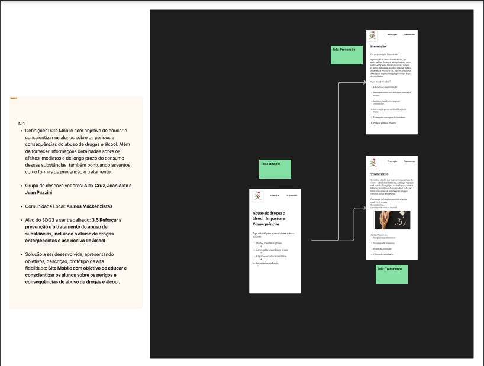

## Projeto Web

### Grupo de Desenvolvedores:

* Alex Cruz de Santana - TIA:32388144
* Jean Alex da Silva - TIA: 42319315
* Jean Pazzini Domingues - TIA: 32387512

### Comunidade Local:

* Alunos Mackenzistas que frequentam festas universitárias.

### Alvo do SDG3 a ser trabalhado:

* 3.5 Reforçar a prevenção e o tratamento do abuso de substâncias, incluindo o abuso de drogas entorpecentes e uso nocivo do álcool

### Objetivos:

Nosso objetivo é educar e conscientizar os alunos sobre os perigos e consequências do abuso de drogas e álcool. Além de fornecer informações detalhadas sobre os efeitos imediatos e de longo prazo do consumo dessas substâncias, também pontuando assuntos como formas de prevenção e tratamento.

### Protótipo de alta fidelidade:

### Link do vídeo:

[Link para vídeo youtube](https://www.youtube.com/watch?v=dNNhpsWcr0s)

